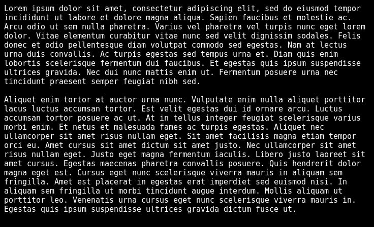

# wipe
Wipe the content of your terminal with a random animation.

This is a fancy alternative to the `clear` command.
It plays randomly generated beautiful animations.

### Build & install
Building this project requires Rust and Cargo to be installed.
```shell
cargo build --release
```
```shell
cp ./target/release/wipe /usr/local/bin
```

### ZSH
There is a [zsh script](misc/wipe.zsh) which can be 
sourced to replace `clear` and `CTRL+L` with this program.

### Arch Linux
There is an [AUR package](https://aur.archlinux.org/packages/wipe-term) called `wipe-term`.
The zsh script can be sourced like this:
```shell
source /usr/share/zsh/plugins/wipe/wipe.zsh
```

## Showcase
[]()
[]()
[]()