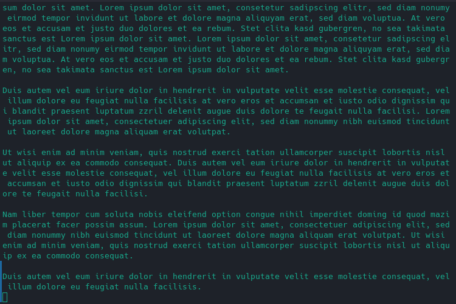
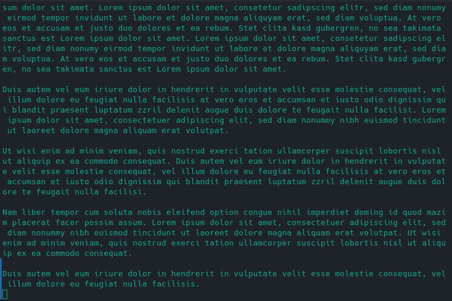

# Wipe
Wipe your terminal with a smooth animation.

This is the perfect program for you, if you like `clear` but want to add an unnecessary animation.

## Configuration
All configuration is done using command line parameters.
If you want a persistent solution, you can add an alias to your `.bashrc` equivalent.

TODO

## Showcase

