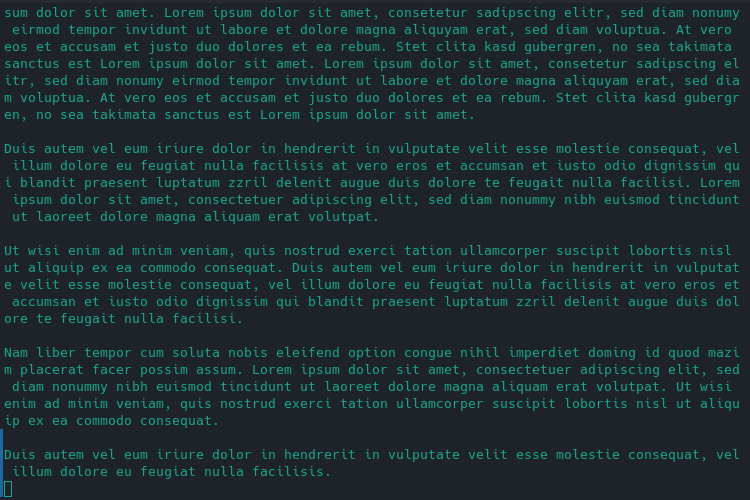

# Wipe
Wipe your terminal with a smooth animation.

This is the perfect program for you, if you like `clear` but want to add an unnecessary animation.

Download options can be found in the [release tab](https://github.com/ricoriedel/wipe/releases).

## Configuration
All configuration is done using command line parameters.
If you want a persistent solution, you can add an alias to your `.bashrc` equivalent.

For a list of parameters, execute `wipe -h`.
Note that some parameters like `--color` can be specified multiple times with different values.

## Showcase

